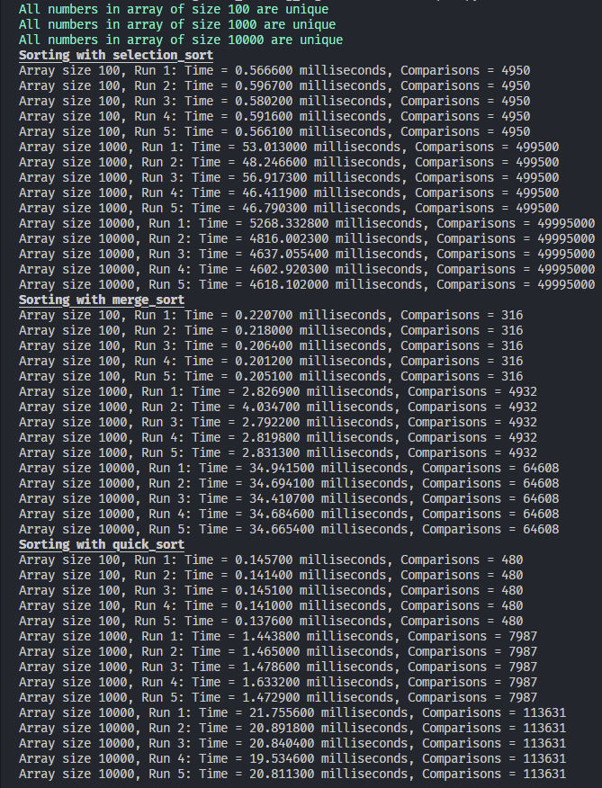

# Python Assignment for Computational Thinking

Tasks involve:
Random name generator after trimming 4000 names from firstNames and lastNames, before combining them randomly to make 4000 full names. Save them into a file and also record the longest name in term of characters and print it to the console.

Random array generator of lengths:

- 100
- 1,000
- 10,000

The arrays will simulate a real world dataset. Each generated number in the array will have a value between 100,000 and 999,999.

Sort the array using three Selection Algorithms; Selection sort, Merge sort and Quicksort.

Apply each algorithm separately and ensure you sort copies of the original array to keep data integrity intact.

## Performance analysis

Measure and analyse the following performance metrics for each sorting algorithm and dataset size including:

- The execution time (in milliseconds) for sorting each array
- Number of comparison made during the sorting process

  
Show image

    

## Graphical comparison of sorting algorithms

Generate and create graphs (e.g. line charts, bar charts, scatter graph) to visually compare the performance of the three sorting algorithms across various dataset sizes.
Present the execution time versus the array sizes in a clear and concise manner to facilitate easy comparison.

.png> 'Sorting Algorithm Graph Example')
